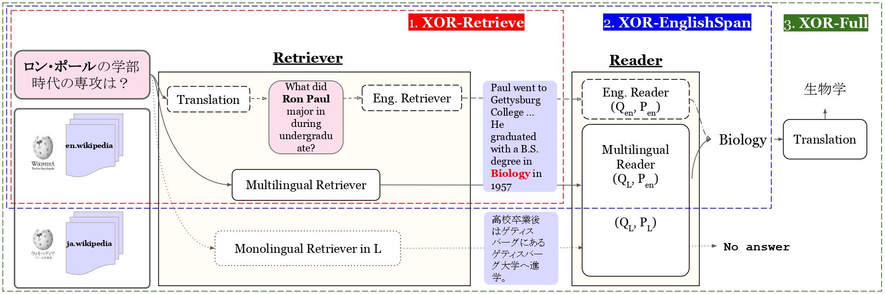

# XOR QA: Cross-lingual Open-Retrieve Question Answering

[**Tasks**](#the-tasks) | [**Download**](#download-the-dataset) |
[**Baselines**](#building-a-baseline-system) | [**Evaluation**](#evaluation) |
[**Website and Leader board**](https://nlp.cs.washington.edu/xorqa/) |
[**Paper**](https://arxiv.org/abs/2010.11856) | [**Changelog**](CHANGELOG.md)

## Introduction
**XOR-TyDi QA** brings together for the first time **information-seeking questions, open-retrieval QA, and multilingual QA** to create a **multilingual open-retrieval QA dataset that enables cross-lingual answer retrieval**. It consists of questions written by information-seeking native speakers in 7 typologically diverse languages and answer annotations that are retrieved from multilingual document collections. 

## The Tasks
There are three sub-tasks: [**XOR-Retrieve**](##XOR-Retrieve), [**XOR-EnglishSpan**](##XOR-EnglishSpan), and [**XOR-Full**](#XOR-Full).




### XOR-Retrieve
**XOR-Retrieve** is a cross-lingual retrieval task where a question is written in the target language (e.g., Japanese) and a system is required to retrieve English document that answers the question.

### XOR-EnglishSpan
**XOR-English Span** is a cross-lingual retrieval task where a question is written in the target language (e.g., Japanese) and a system is required to output a short answer in English. 


### XOR-Full
**XOR-Full** is a cross-lingual retrieval task where a question is written in the target language (e.g., Japanese) and a system is required to output a short answer in the target language.


## Download the Dataset
You can download the data at the following URLs. 

The datasets below include question and short answer information only. If you need the long answer information for supervised training of retrievers or reader, please download the [GoldParagraph](##gold-paragraph-data) data. 

We also ask you to *use Wikipedia 2019-0201 dump*, which can be downloaded the link from [TyDiQA's source data list](https://github.com/google-research-datasets/tydiqa/blob/master/README.md#source-data) for the 7 languages + English.

### Data for **XOR** tasks
For **XOR-Retrieve** and **XOR-English Span**:
- [Train data](https://nlp.cs.washington.edu/xorqa/XORQA_site/data/xor_train_retrieve_eng_span.jsonl)
- [Development data](https://nlp.cs.washington.edu/xorqa/XORQA_site/data/xor_dev_retrieve_eng_span.jsonl)
- [Test data(Question Only)](https://nlp.cs.washington.edu/xorqa/XORQA_site/data/xor_test_retrieve_eng_span_q_only.jsonl)


For **XOR-Full**:
- [Train data](https://nlp.cs.washington.edu/xorqa/XORQA_site/data/xor_train_full.jsonl)
- [Development data](https://nlp.cs.washington.edu/xorqa/XORQA_site/data/xor_dev_full.jsonl)
- [Test data(Question Only)](https://nlp.cs.washington.edu/xorqa/XORQA_site/data/xor_test_full_q_only.jsonl)

### Additional resources
#### Gold Paragraph Data

- [Gold Paragraph data (similar to TyDi GP)](https://nlp.cs.washington.edu/xorqa/XORQA_site/data/tydi_xor_gp.zip):
The gold paragraph data includes annotated passage answers (gold paragraph) and short answers in the same format as [SQuAD](https://rajpurkar.github.io/SQuAD-explorer/). As in TyDi QA Gold Passage Task, you can directly recycle your SQuAD QA codes. 

- [Reading Comprehension data](https://nlp.cs.washington.edu/xorqa/XORQA_site/data/tydi_xor_rc_yes_no_unanswerable.zip) with `no answer` and `yes/no`:
With a slightly different from the original SQuAD format, the data includes all "long answer only" & "yes-no" questions, as in NQ and TyDi QA full task. 


#### Question translation data
We also make the human annotated 30k question translation data publicly available. As the translation data is only used for annotation and we do not expect use this *oracle* translation, we release the translation for train data only. 

The translation data for each language pair (English-{Arabic, Bengali, Finnish, Japanese, Korean, Russian, Telugu}) is represented as a pair of text file, in which each line include one sentence corresponding to the translated English question, following common MT corpora.

The list of the links to parallel corpora (`L_i`-to-English) is below:

- [ar-en.zip](https://nlp.cs.washington.edu/xorqa/XORQA_site/data/ar-en.zip)
- [bn-en.zip](https://nlp.cs.washington.edu/xorqa/XORQA_site/data/bn-en.zip)
- [fi-en.zip](https://nlp.cs.washington.edu/xorqa/XORQA_site/data/fi-en.zip)
- [ja-en.zip](https://nlp.cs.washington.edu/xorqa/XORQA_site/data/ja-en.zip)
- [ko-en.zip](https://nlp.cs.washington.edu/xorqa/XORQA_site/data/ko-en.zip)
- [ru-en.zip](https://nlp.cs.washington.edu/xorqa/XORQA_site/data/ru-en.zip)
- [fi-en.zip](https://nlp.cs.washington.edu/xorqa/XORQA_site/data/fi-en.zip)


## Building a baseline system
Our baseline includes: [Dense Passage Retriever](https://github.com/facebookresearch/DPR) ([Karpukhin et al., 2020](https://arxiv.org/abs/2004.04906)), [Path Retriever](https://github.com/AkariAsai/learning_to_retrieve_reasoning_paths) ([Asai et al., 2020](https://arxiv.org/abs/1911.10470)), BM25 (implementations are based on ElasticSearch)+multilingual QA models.

Please see [baselines/README.md](baselines/README.md) for more information.

## Evaluation
To evaluate your modes' predictions on development data, please run the commands below. Please see the details of the prediction file format and make sure your prediction results follow the format. 

You also needs to install MeCab and NLTK before running evaluation -- they are used to tokenization for XOR-Retrieve and for evaluations on Japanese answers. 

```
pip install mecab-python3
pip install unidic-lite
pip install nltk
```

- XOR Retrieve (metrics: R@2kt, R@5kt)
```
python3 evals/eval_xor_retrieve.py \
    --data_file <path_to_input_data> \
    --pred_file <path_to_predictions>
```

- XOR-Full (metrics: F1, EM)
```
python3 evals/eval_xor_engspan.py \
    --data_file <path_to_input_data> \
    --pred_file <path_to_predictions>
```

- XOR-English Span (metrics: F1, EM, BLEU)

```
python3 evals/eval_xor_full.py \
    --data_file <path_to_input_data> \
    --pred_file <path_to_predictions>
```

### Prediction file format
To evaluate your model's predictions, you need to format the predicted results in specific formats. 

#### XOR-Retrieve
**Note**: Our evaluation script evaluate if the correct answers are included in the first 2,000 tokens and 5,000 tokens for R@2kt and R@5kt, respectively. Please make sure the total token numbers of your retrieved document would be larger than those tokens; otherwise your scores might be underestimated. See the detailed definition of those metrics in our paper. 

The XOR-Retrieve file should be output as follows:

```
["id": 12345, "lang": "ja, ctxs": ["Tokyo (東京) is the capital and most populous prefecture of Japan.", "Located at the head of Tokyo Bay, the prefecture forms part of the Kantō region on the central Pacific coast of Japan's main island, Honshu. " ... ]
]
```

#### XOR-Full, XOR-English Span
For those two tasks, your prediction file should be a json file of a dictionary, whose keys are question ids and values are the predicted short answers. 

e.g.,
```
{"12345": "東京", "67890": "Москва", ...}
```


## Submission guide
If you want to submit to our leaderboard, please create the prediction files on our test data for your target task, and email it to Akari Asai (akari[at]cs.washington.edu). 

Please make sure you include the following information in the email. 

- test prediction file in our [prediction file format](#prediction-file-format)
- the task name 
- the name of the model
- whether you use external black box API (e.g., Google Translate / Google Custom Search / Bing Search) which cannot be reproduced on your side. To coordinate open research, we encourage you to use reproducible components, and the system with those external (unreproducible) components will be populated below the entries w/o APIs. 
- [optional] the institution. You can update those information later. 
- [optional] link to the paper and code. You can update those information later. 


#### Notes
- The models will be sorted by F1 score for XOR-English Span and XOR-Full, and by R@5kt for XOR-Retrieve.
- Please perform any model selection or ablation necessary to improve model performance on the dev set only. We limit the number of submissions to be 20 per year and 3 per month.
- If you plan to have your model officially evaluated, please plan 1 weeks in advance to allow sufficient time for your model results to be on the leaderboard. 


## Citation and Contact
If you find this codebase is useful or use in your work, please cite our paper.

```
@article{xorqa,
    title   = {XOR QA: Cross-lingual Open-Retrieval Question Answering},
    author  = {Akari Asai and Jungo Kasai and Jonathan H. Clark and Kenton Lee and Eunsol Choi and Hannaneh Hajishirzi}
    year    = {2020}
}
```

Please contact Akari Asai (@AkariAsai, akari[at]cs.washington.edu) for questions and suggestions.